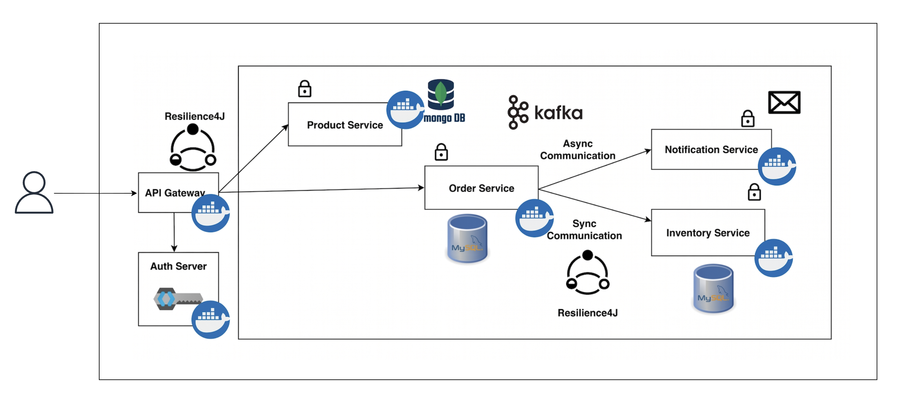

# Distributed Microservices Backend

A distributed commerce backend built with **Java** and **Spring Boot**, demonstrating a complete microservices architecture. The platform handles product management, order placement with real-time inventory validation and asynchronous email notifications, all secured behind a JWT-authenticated API gateway.

## Overview

The backend is composed of five independently deployable microservices (product, order, inventory, notification, api-gateway). Each service owns its own database, has no direct schema coupling to other services and communicates through well-defined contracts, either synchronous REST or asynchronous Kafka events.

The entire stack (5 application services + Kafka + Keycloak + 3 MySQL instances + MongoDB + Kafka UI) is orchestrated with a single `docker compose up` command using pre-built Docker Hub images.

---

## Architecture Diagram



---

## Key Features

- **Unified, secured API gateway**: single entry point with JWT validation and circuit breakers on every route
- **Resilience patterns**: circuit breaker + retry + timeout applied at both the gateway layer and the inter-service HTTP call level
- **Event-driven notifications**: order events published to Kafka; email sent asynchronously without coupling the order response time to mail delivery
- **Polyglot persistence**: right database for each domain: MongoDB for flexible product catalog, MySQL for transactional order and inventory data
- **Single-command deployment**: `docker compose up` starts all 11 containers with correct startup ordering

---

## Technology Stack

Java, Spring Boot, Spring Cloud Gateway MVC, Keycloak, Spring OAuth2 Resource Server, Apache Kafka, Resilience4j (Circuit Breaker, Retry, TimeLimiter), Spring RestClient + HttpServiceProxyFactory, MongoDB, MySQL, Flyway, SpringDoc OpenAPI / Swagger UI, Spring Mail + Mailtrap SMTP sandbox, Unit 5 + Testcontainers + REST Assured, Spring Boot Buildpacks, Docker Hub, Docker Compose

---

## Microservices

### 1) API Gateway (port: 9000)

The single entry point for all client requests. Built with **Spring Cloud Gateway MVC**.

**Responsibilities:**
- Validates Keycloak-issued JWT tokens as an OAuth2 Resource Server
- Routes requests to the appropriate downstream service
- Applies a **Resilience4j circuit breaker** on every route

---

### 2) Product Service

Manages the product catalog.

**Database:** MongoDB 7.0 (document store, flexible schema for catalog data)

**API:**
| Method | Endpoint | Description |
|---|---|---|
| `POST` | `/api/product` | Create a new product |
| `GET` | `/api/product` | Retrieve all products |

**Domain Model:**
```json
{
  "id": "ObjectId (auto-generated)",
  "name": "iPhone 15",
  "description": "iPhone 15 is a smartphone from Apple",
  "skuCode": "iphone_15",
  "price": 999.99
}
```

---

### 3) Order Service

Orchestrates the order placement flow

**Responsibilities:**
- Calls Inventory Service synchronously to verify stock availability before accepting an order
- Uses Spring 6.1 `RestClient` + `HttpServiceProxyFactory` with declarative `@CircuitBreaker` and `@Retry` annotations on the `InventoryClient` interface
- Persists accepted orders with a UUID order number
- Publishes an `OrderPlacedEvent` to the Kafka topic `order-placed`

**Database:** MySQL 8.3, schema managed by **Flyway** migrations

**API:**
| Method | Endpoint | Description |
|---|---|---|
| `POST` | `/api/order` | Place a new order |

**Request Body:**
```json
{
  "skuCode": "iphone_15",
  "price": 999.99,
  "quantity": 1,
  "userDetails": {
    "email": "customer@example.com",
    "firstName": "John",
    "lastName": "Doe"
  }
}
```
---

### 4) Inventory Service

**Database:** MySQL 8.3, schema managed by **Flyway** migrations (includes seed data)

**API:**
| Method | Endpoint | Description |
|---|---|---|
| `GET` | `/api/inventory?skuCode=iphone_15&quantity=1` | Check if SKU is in stock |

Returns `true` / `false`.

---

### 5) Notification Service

Asynchronous, event-driven email dispatcher.

**Trigger:** Kafka `@KafkaListener` on topic `order-placed` (consumer group: `notificationService`)

**Responsibilities:**
- Consumes `OrderPlacedEvent` messages deserialized via `JacksonJsonDeserializer` with explicit type mapping
- Sends a transactional HTML email to the customer via **Mailtrap SMTP sandbox**
- Fully decoupled from the order flow, failure here does not affect order placement

---

## Project Structure

```
distributed-microservices-backend/
│
├── docker-compose.yml              # Root orchestration file — runs the full stack
├── .env                            # Mailtrap SMTP credentials (not committed)
│
├── api-gateway/                    # Spring Cloud Gateway MVC, Keycloak OAuth2, Resilience4j
│   ├── src/main/java/com/learn/gateway/
│   │   ├── config/SecurityConfig.java      # OAuth2 JWT resource server config
│   │   └── routes/Routes.java              # All gateway routes + circuit breakers
│   ├── docker/keycloak/realms/             # Keycloak realm export (auto-imported)
│   └── pom.xml
│
├── product-service/                # Product catalog — MongoDB
│   ├── src/main/java/com/learn/product/
│   │   ├── controller/ProductController.java
│   │   ├── service/ProductService.java
│   │   ├── model/Product.java               # @Document MongoDB entity
│   │   ├── dto/                             # Java Records (ProductRequest, ProductResponse)
│   │   └── config/OpenAPIConfig.java
│   ├── src/test/                            # REST Assured + Testcontainers integration test
│   └── pom.xml
│
├── order-service/                  # Order orchestration — MySQL + Kafka producer
│   ├── src/main/java/com/learn/order/
│   │   ├── controller/OrderController.java
│   │   ├── service/OrderService.java        # Core: stock check → save → publish Kafka event
│   │   ├── client/InventoryClient.java      # Declarative RestClient with @CircuitBreaker
│   │   ├── config/RestClientConfig.java     # HttpServiceProxyFactory setup
│   │   ├── event/OrderPlacedEvent.java      # Kafka event payload
│   │   ├── model/Order.java                 # JPA entity
│   │   └── dto/OrderRequest.java            # Java Record with nested UserDetails
│   ├── src/main/resources/db/migration/    # Flyway SQL migrations
│   ├── docker/mysql/init.sql               # DB creation script (Docker init)
│   └── pom.xml
│
├── inventory-service/              # Stock availability checker — MySQL (read-only)
│   ├── src/main/java/com/learn/inventory/
│   │   ├── controller/InventoryController.java
│   │   ├── service/InventoryService.java
│   │   ├── repository/InventoryRepository.java   # JPA derived query
│   │   └── model/Inventory.java
│   ├── src/main/resources/db/migration/    # Flyway SQL migrations + seed data
│   ├── docker/mysql_script/init.sql        # DB creation script (Docker init)
│   └── pom.xml
│
└── notification-service/           # Async email sender — Kafka consumer + Spring Mail
    ├── src/main/java/
    │   ├── com/learn/notification/service/NotificationService.java  # @KafkaListener
    │   └── com/learn/order/event/OrderPlacedEvent.java              # Event DTO (mirrored)
    └── pom.xml
```

---

## Requirements

- Docker and Docker Compose (v2+)
- A `.env` file in the project root (see environment variables)

> Java 21 and Maven are only required if you want to build or run services locally outside Docker.

---

## Running the Project

### 1. Clone the repository

```bash
git clone https://github.com/mayur7922/distributed-microservices-backend
cd "distributed-microservices-backend"
```

### 2. Create the `.env` file

Create a `.env` file in the project root with your [Mailtrap](https://mailtrap.io) SMTP credentials:

```env
MAIL_TRAP_USERNAME=your_mailtrap_username
MAIL_TRAP_PASSWORD=your_mailtrap_password
```

### 3. Start the entire stack

```bash
docker compose up -d
```

This single command pulls pre-built images from Docker Hub and starts all 11 containers in the correct dependency order:

```
Zookeeper → Kafka → Kafka UI
Keycloak MySQL → Keycloak
Order MySQL → Order Service
Inventory MySQL → Inventory Service
MongoDB → Product Service
Product Service + Order Service + Inventory Service → API Gateway
Kafka → Notification Service
```

### 4. Verify all containers are running

```bash
docker compose ps
```

All containers should show `running` status.

### 5. Obtain an access token from Keycloak

```bash
curl -X POST http://localhost:8181/realms/spring-microservices-security-realm/protocol/openid-connect/token \
  -H "Content-Type: application/x-www-form-urlencoded" \
  -d "grant_type=password" \
  -d "client_id=<your-client-id>" \
  -d "username=<your-username>" \
  -d "password=<your-password>"
```

Use the `access_token` from the response as the `Bearer` token in all API requests.

### 6. Stop the stack

```bash
docker compose down
```